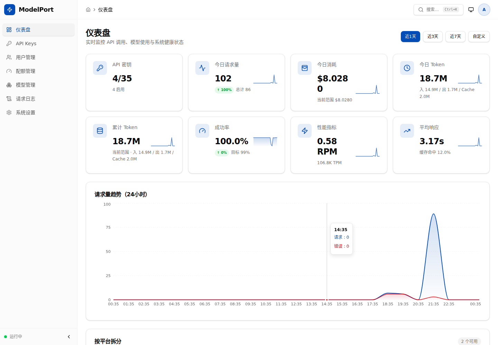
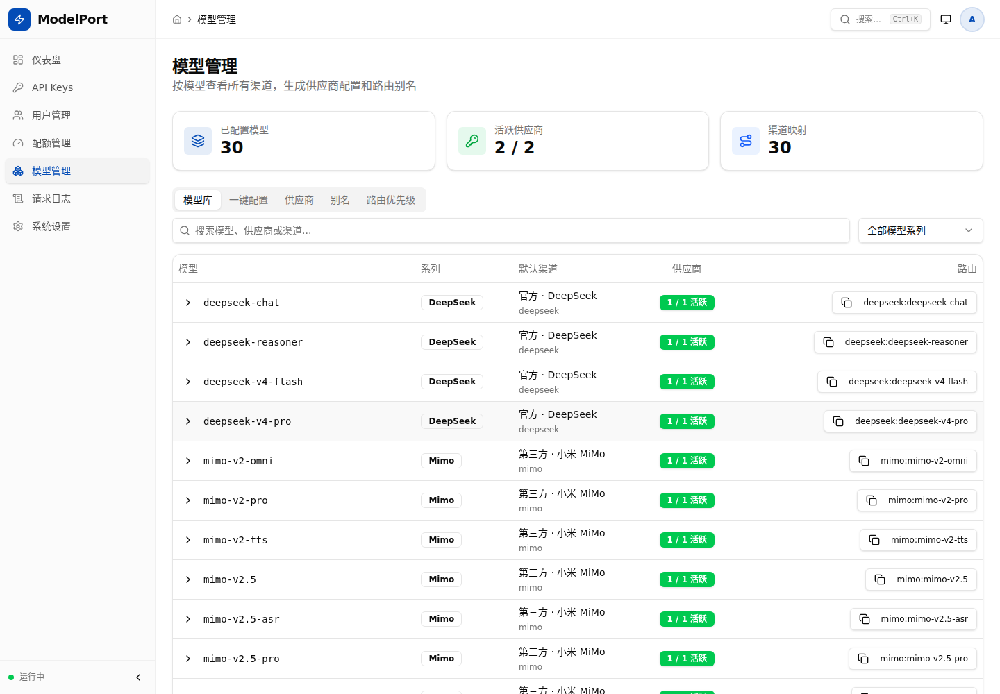
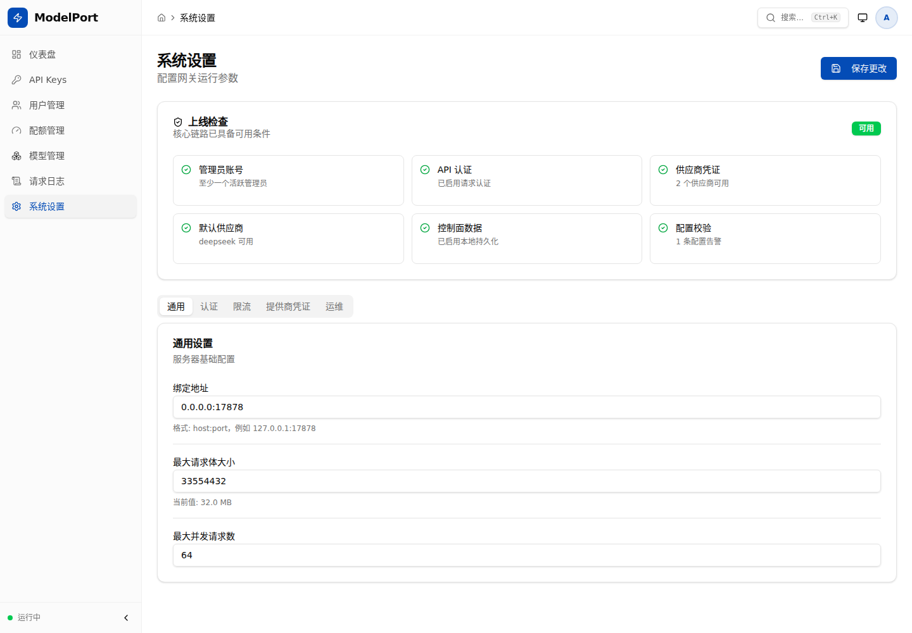

# ModelPort

[](https://github.com/tiammomo/ModelPort/actions/workflows/ci.yml)

**English** | [简体中文](README.zh-CN.md)

ModelPort is a local model gateway for Claude Code and VS Code Claude. It exposes an Anthropic-compatible `/v1/messages` endpoint on your machine, then routes requests to DeepSeek, Mimo, Anthropic, OpenAI-compatible providers, OpenRouter, Ollama, or custom local runtimes.

The goal is practical: keep your editor workflow unchanged while switching models through one local, observable, authenticated port.


## Current Working Profile

This workspace is currently configured and verified with:

| Item | Current value |
| --- | --- |
| Dashboard | `http://127.0.0.1:5173` |
| Local API | `http://127.0.0.1:17878` |
| Default provider | `deepseek` |
| Claude model | `deepseek-v4-pro` |
| Storage | Docker Compose PostgreSQL volume |

`mimo-v2.5-pro` is still supported by the router, but upstream quota, balance, and rate limits decide whether it is usable at any moment. The current local Claude settings point to `deepseek-v4-pro`.

## Product Screens

These screenshots are captured from the running local dashboard, not mockups.

### Operations Dashboard

The dashboard shows API key status, request volume, token usage, cost estimates, success rate, provider health, model distribution, and recent usage.



### Model And Provider Management

The model page shows registered models, default routes, provider mappings, aliases, provider lifecycle controls, and model inventory.



### System Settings

System settings expose readiness checks, server parameters, authentication, rate limits, provider credentials, runtime diagnostics, backup/export, and config reload operations.



## What It Does

- Authenticates local clients with `x-api-key` or `Authorization: Bearer`.
- Accepts Anthropic Messages API requests from Claude Code and VS Code Claude.
- Converts requests to upstream Anthropic-compatible or OpenAI-compatible provider APIs.
- Routes by `provider:model`, aliases, explicit model IDs, and model prefixes.
- Tracks requests, latency, retries, input/output/cache tokens, provider health, and cost estimates.
- Provides a web dashboard for API keys, users, teams/projects, quotas, logs, provider configuration, model inventory, aliases, backup, and runtime settings.
- Supports Docker Compose, local source development, systemd deployment, Prometheus metrics, and production acceptance scripts.

ModelPort is meant for personal and small-team trusted environments. Do not expose it directly to the public internet.

## Quick Start

The fastest complete stack is Docker Compose: backend API, dashboard UI, and internal PostgreSQL.

```bash
cp deploy/docker/modelport.env.example .env
```

Edit `.env` and set at least:

```bash
MODELPORT_AUTH_TOKEN=replace-with-a-long-random-local-token
ANTHROPIC_AUTH_TOKEN=replace-with-the-same-local-router-token
MODELPORT_ADMIN_USERNAME=admin
MODELPORT_ADMIN_PASSWORD=replace-with-a-long-random-admin-password
MODELPORT_POSTGRES_PASSWORD=replace-with-a-long-random-postgres-password

MODELPORT_DEFAULT_PROVIDER=deepseek
DEEPSEEK_ANTHROPIC_BASE_URL=https://api.deepseek.com/anthropic
DEEPSEEK_ANTHROPIC_AUTH_TOKEN=replace-with-real-deepseek-api-key
DEEPSEEK_MODEL=deepseek-v4-pro

ANTHROPIC_BASE_URL=http://127.0.0.1:17878
ANTHROPIC_MODEL=deepseek-v4-pro
ANTHROPIC_DEFAULT_OPUS_MODEL=deepseek-v4-pro
ANTHROPIC_DEFAULT_SONNET_MODEL=deepseek-v4-pro
ANTHROPIC_DEFAULT_HAIKU_MODEL=deepseek-v4-pro
ANTHROPIC_SMALL_FAST_MODEL=deepseek-v4-pro
CLAUDE_CODE_SUBAGENT_MODEL=deepseek-v4-pro
```

Start the stack:

```bash
docker compose up -d --build
docker compose ps
```

Open:

- Dashboard: `http://127.0.0.1:5173`
- Health check: `http://127.0.0.1:17878/health`
- Messages API: `http://127.0.0.1:17878/v1/messages`

Log in to the dashboard with `MODELPORT_ADMIN_USERNAME` and `MODELPORT_ADMIN_PASSWORD`.

## Claude Code Setup

Configure VS Code Claude / Claude Code with the local gateway URL and the same router token from `.env`.

Common settings paths:

```bash
# Linux / WSL
~/.config/Code/User/settings.json

# Windows path from WSL
/mnt/c/Users/<you>/AppData/Roaming/Code/User/settings.json
```

Recommended settings:

```json
{
  "claudeCode.selectedModel": "deepseek-v4-pro",
  "claudeCode.environmentVariables": [
    {
      "name": "ANTHROPIC_BASE_URL",
      "value": "http://127.0.0.1:17878"
    },
    {
      "name": "ANTHROPIC_AUTH_TOKEN",
      "value": "replace-with-the-same-local-router-token"
    },
    {
      "name": "ANTHROPIC_MODEL",
      "value": "deepseek-v4-pro"
    },
    {
      "name": "ANTHROPIC_DEFAULT_OPUS_MODEL",
      "value": "deepseek-v4-pro"
    },
    {
      "name": "ANTHROPIC_DEFAULT_SONNET_MODEL",
      "value": "deepseek-v4-pro"
    },
    {
      "name": "ANTHROPIC_DEFAULT_HAIKU_MODEL",
      "value": "deepseek-v4-pro"
    },
    {
      "name": "ANTHROPIC_SMALL_FAST_MODEL",
      "value": "deepseek-v4-pro"
    },
    {
      "name": "CLAUDE_CODE_SUBAGENT_MODEL",
      "value": "deepseek-v4-pro"
    }
  ]
}
```

Reload VS Code or restart the Claude Code session after editing settings.

## Verify The Running Gateway

Local service health:

```bash
curl http://127.0.0.1:17878/health
```

Authenticated model list:

```bash
source .env
curl -sS \
  -H "x-api-key: $MODELPORT_AUTH_TOKEN" \
  http://127.0.0.1:17878/v1/models
```

Real `deepseek-v4-pro` message call:

```bash
source .env
curl -sS \
  -H "x-api-key: $MODELPORT_AUTH_TOKEN" \
  -H "Content-Type: application/json" \
  http://127.0.0.1:17878/v1/messages \
  -d '{
    "model": "deepseek-v4-pro",
    "max_tokens": 96,
    "messages": [
      {
        "role": "user",
        "content": "Reply exactly: OK"
      }
    ]
  }'
```

Provider compatibility check:

```bash
scripts/provider-matrix.sh --model deepseek-v4-pro
```

Full local checks:

```bash
scripts/config-validate.sh
scripts/status.sh
scripts/acceptance.sh
```

`scripts/acceptance.sh --upstream` and `scripts/provider-matrix.sh --all` make real provider calls and may incur upstream cost.

## API Surface

| Endpoint | Auth | Purpose |
| --- | --- | --- |
| `GET /health` | No | Runtime health and provider status. |
| `GET /v1/models` | Yes | Anthropic-style model listing. |
| `POST /v1/messages` | Yes | Anthropic-compatible messages API. |
| `GET /metrics` | Yes | Prometheus text metrics. |
| `/admin/*` | Cookie session | Dashboard and control-plane APIs. |

Example auth headers:

```http
x-api-key: <MODELPORT_AUTH_TOKEN>
Authorization: Bearer <MODELPORT_AUTH_TOKEN>
```

The dashboard uses account login, not the router token. The first admin is bootstrapped from `MODELPORT_ADMIN_USERNAME` and `MODELPORT_ADMIN_PASSWORD`.

## Providers

| Provider | Protocol | Main environment variables |
| --- | --- | --- |
| `deepseek` | Anthropic-compatible | `DEEPSEEK_ANTHROPIC_AUTH_TOKEN`, `DEEPSEEK_MODEL` |
| `deepseek_openai` | OpenAI-compatible | `DEEPSEEK_OPENAI_API_KEY`, `DEEPSEEK_OPENAI_MODEL`, `DEEPSEEK_API_KEY` |
| `mimo` | OpenAI-compatible | `BASE_URL`, `MIMO_OPENAI_BASE_URL`, `MIMO_OPENAI_API_KEY`, `MIMO_MODEL` |
| `anthropic` | Anthropic-compatible | `ANTHROPIC_API_KEY`, `ANTHROPIC_UPSTREAM_MODEL` |
| `openai` | OpenAI-compatible | `OPENAI_API_KEY`, `OPENAI_MODEL` |
| `openrouter` | OpenAI-compatible | `OPENROUTER_API_KEY`, `OPENROUTER_MODEL` |
| `gemini` | OpenAI-compatible | `GEMINI_API_KEY`, `GEMINI_MODEL` |
| `xai` | OpenAI-compatible | `XAI_API_KEY`, `XAI_MODEL` |
| `groq` | OpenAI-compatible | `GROQ_API_KEY`, `GROQ_MODEL` |
| `dashscope` | OpenAI-compatible | `DASHSCOPE_API_KEY`, `DASHSCOPE_MODEL` |
| `kimi` | OpenAI-compatible | `MOONSHOT_API_KEY`, `KIMI_MODEL` |
| `zhipu` | OpenAI-compatible | `ZHIPU_API_KEY`, `ZHIPU_MODEL` |
| `mistral` | OpenAI-compatible | `MISTRAL_API_KEY`, `MISTRAL_MODEL` |
| `ark` | OpenAI-compatible | `ARK_API_KEY`, `ARK_MODEL` |
| `ollama` | OpenAI-compatible | `MODELPORT_ENABLE_OLLAMA`, `OLLAMA_MODEL` |
| `custom` | OpenAI-compatible | `CUSTOM_OPENAI_BASE_URL`, `CUSTOM_OPENAI_MODEL` |
| `local_sglang` | OpenAI-compatible | `MODELPORT_ENABLE_LOCAL_SGLANG`, `SGLANG_BASE_URL`, `SGLANG_MODEL` |
| `local_vllm` | OpenAI-compatible | `MODELPORT_ENABLE_LOCAL_VLLM`, `VLLM_BASE_URL`, `VLLM_MODEL` |
| `local_llamacpp` | OpenAI-compatible | `MODELPORT_ENABLE_LOCAL_LLAMACPP`, `LLAMACPP_BASE_URL`, `LLAMACPP_MODEL` |

See [docs/PROVIDER_MATRIX.md](docs/PROVIDER_MATRIX.md) for compatibility status and verification notes.

## Model Switching

Set a model directly:

```bash
export ANTHROPIC_MODEL=deepseek-v4-pro
export ANTHROPIC_MODEL=mimo-v2.5-pro
export ANTHROPIC_MODEL=qwen-plus
```

Force a provider:

```bash
export ANTHROPIC_MODEL=deepseek:deepseek-v4-pro
export ANTHROPIC_MODEL=mimo:mimo-v2.5-pro
export ANTHROPIC_MODEL=openrouter:anthropic/claude-sonnet-4
export ANTHROPIC_MODEL=custom:any-model-name-from-your-upstream
```

Configure aliases in `config.toml`:

```toml
[aliases]
main = "deepseek:deepseek-v4-pro"
mimo = "mimo:mimo-v2.5-pro"
local = "local_vllm:qwen2.5-coder"
```

Then use:

```bash
export ANTHROPIC_MODEL=main
```

Dashboard changes to aliases, provider order, default provider, provider lifecycle, and model inventory can be applied at runtime. Service-level changes such as listen address and concurrency limits still require a backend restart.

## Local Development

Backend only:

```bash
cp .env.example .env
scripts/start.sh
scripts/status.sh
```

Dashboard development server:

```bash
cd dashboard
npm ci
npm run dev
```

The Vite dashboard listens on `http://127.0.0.1:5173` and proxies `/admin`, `/v1`, `/health`, and `/metrics` to the backend.

Foreground backend development:

```bash
scripts/dev.sh
```

Checks before committing:

```bash
scripts/check.sh
cd dashboard
npm run lint
npm run build
```

## Operations

Common Docker commands:

```bash
docker compose ps
docker compose logs -f modelport
docker compose restart modelport
docker compose down
```

Backup and validate:

```bash
docker compose exec modelport model-port backup export /data/modelport-backup.json
docker compose exec modelport model-port backup validate /data/modelport-backup.json
```

Prometheus metrics:

```bash
source .env
curl -sS \
  -H "x-api-key: $MODELPORT_AUTH_TOKEN" \
  http://127.0.0.1:17878/metrics
```

Useful scripts:

| Script | Purpose |
| --- | --- |
| `scripts/config-validate.sh` | Validate configuration without starting the service. |
| `scripts/start.sh` | Build and start the local backend in the background. |
| `scripts/stop.sh` | Stop the local backend started by scripts. |
| `scripts/restart.sh` | Restart the local backend. |
| `scripts/status.sh` | Show PID, log path, listener, and `/health` status. |
| `scripts/doctor.sh` | Check env, service, auth, VS Code settings, and key endpoints. |
| `scripts/provider-matrix.sh` | Verify non-streaming and streaming compatibility for selected models. |
| `scripts/acceptance.sh` | Run personal/small-team production acceptance checks. |
| `scripts/bench.sh` | Measure local and optional upstream latency. |
| `scripts/build-release.sh` | Build `target/release/model-port`. |
| `scripts/check.sh` | Run fmt, tests, and clippy. |

## Troubleshooting

| Symptom | Meaning | Fix |
| --- | --- | --- |
| Startup reports missing token | `MODELPORT_AUTH_TOKEN` or `ANTHROPIC_AUTH_TOKEN` is not set | Set both values and make them match. |
| `/v1/models` returns 401 | Client token is missing or wrong | Check `x-api-key` or `ANTHROPIC_AUTH_TOKEN`. |
| Claude Code still uses the old model | VS Code has not reloaded settings | Reload VS Code or restart the Claude Code session. |
| Provider is `degraded` or `cooldown` | Recent upstream calls failed | Open dashboard settings/logs, test the provider, then check upstream quota and status. |
| Upstream returns 403 | Provider account or key was rejected | Check upstream key, account permission, and balance. |
| Upstream returns 429 | Provider rate limit or quota was hit | Wait, reduce traffic, or switch provider. |
| Large request returns 413 | Request body is above the configured limit | Increase `MODELPORT_MAX_REQUEST_BODY_BYTES`. |
| Streaming returns `event: error` | Upstream streaming failed after the local request started | Inspect request logs and backend logs. |

Recommended backend log level:

```bash
RUST_LOG=model_port=info,tower_http=info
```

## Documentation

- [docs/PROJECT_GUIDE.md](docs/PROJECT_GUIDE.md): project positioning, architecture boundaries, and roadmap.
- [docs/PROVIDER_MATRIX.md](docs/PROVIDER_MATRIX.md): provider compatibility matrix and verification process.
- [docs/ACCEPTANCE.md](docs/ACCEPTANCE.md): production acceptance checklist.
- [docs/DOCKER.md](docs/DOCKER.md): Docker Compose deployment and PostgreSQL persistence.
- [docs/LOCAL_RUNTIME.md](docs/LOCAL_RUNTIME.md): SGLang, vLLM, llama.cpp, Ollama, and custom local runtime integration.
- [docs/PERFORMANCE.md](docs/PERFORMANCE.md): benchmark guidance and runtime tuning.
- [docs/GITHUB_SETUP.md](docs/GITHUB_SETUP.md): release and repository setup notes.
- [dashboard/README.md](dashboard/README.md): dashboard development and E2E test guidance.

## Non-Goals

ModelPort intentionally stays small:

- It is not a chat client.
- It is not a cloud model aggregation platform.
- It is not an enterprise IAM, external billing, or public multi-tenant SaaS system.
- It does not run model inference locally; it routes and adapts protocols.
- It does not try to support every provider-native API; it focuses on Anthropic-compatible and OpenAI-compatible APIs.
