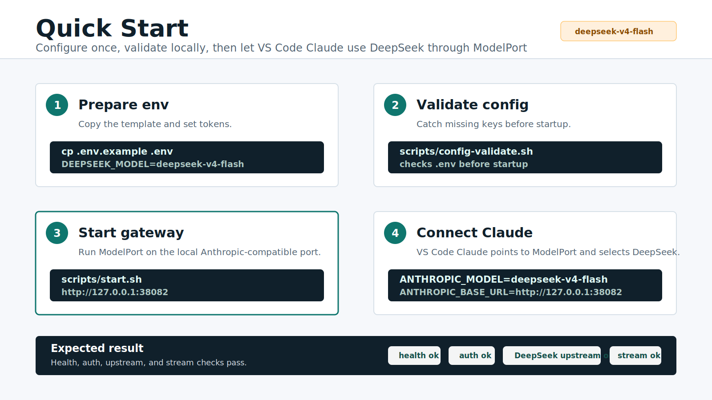

# ModelPort

[](https://github.com/tiammomo/ModelPort/actions/workflows/ci.yml)

**English** | [简体中文](README.zh-CN.md)


_Architecture overview: Claude clients call local ModelPort, then ModelPort handles auth, routing, protocol conversion, streaming, and metrics before reaching configured providers._

**ModelPort is a local model gateway for Claude Code and VS Code Claude.**

It exposes an Anthropic-compatible `/v1/messages` endpoint on your machine, then routes Claude Code / VS Code Claude requests to Mimo, DeepSeek, Anthropic, OpenAI-compatible providers, OpenRouter, Ollama, or a custom upstream. The core goal is simple: keep the editor workflow unchanged while making different foundation models usable through one stable local port.

## Status

ModelPort is production-ready within its current scope:

- Suitable for personal long-running local usage and daily VS Code Claude / Claude Code development.
- Suitable for small internal production or pilot deployments behind a trusted network boundary or reverse proxy.
- Not recommended for direct public internet exposure.
- Not a multi-tenant SaaS gateway; it does not provide user accounts, billing, quotas, audit retention, or fine-grained RBAC.

Verified baseline:

- Third-party Mimo base URL: `https://w.ciykj.cn/v1`
- Model: `mimo-v2.5-pro`
- Non-streaming `/v1/messages`
- Streaming `/v1/messages`
- VS Code Claude settings on Windows/WSL
- `doctor`, `provider-matrix`, `/metrics`, and configuration validation

## Features

- Local token authentication; starting without auth is disabled by default.
- Anthropic-compatible entry API.
- OpenAI-compatible upstream protocol conversion.
- `provider:model`, model aliases, model prefixes, and unknown-model passthrough.
- Native `reqwest` / `rustls` HTTP transport, with no system `curl` subprocess.
- Upstream connection pooling, connection timeout, request timeout, and stream idle timeout.
- Request body, response body, and concurrency limits.
- Mimo streaming text de-duplication to avoid repeated fragments in Claude Code output.
- Runtime `doctor`, static `config validate`, provider matrix checks, and Prometheus `/metrics`.
- Docker Compose, systemd, quick-start scripts, and GitHub Actions CI.

## Positioning

ModelPort is not a large all-in-one model aggregation platform. It is a lightweight, local, controllable developer model routing adapter.

- For users: a local port that lets Claude Code connect to common code models.
- For developers: a small protocol gateway from Anthropic Messages API to multiple providers.
- For long-term evolution: a minimal local AI provider control plane for model naming, routing, protocol conversion, key isolation, and provider policy.

## Documentation

- [docs/PROJECT_GUIDE.md](docs/PROJECT_GUIDE.md): positioning, architecture boundaries, and roadmap.
- [docs/PROVIDER_MATRIX.md](docs/PROVIDER_MATRIX.md): provider compatibility matrix, verification status, and acceptance criteria.
- [docs/PERFORMANCE.md](docs/PERFORMANCE.md): efficiency, benchmarks, metrics, and production tuning.
- [docs/GITHUB_SETUP.md](docs/GITHUB_SETUP.md): GitHub repository settings, branch protection, and release suggestions.
- [docs/GPT_IMAGE_2_GUIDE.md](docs/GPT_IMAGE_2_GUIDE.md): future image capability guidance.

## Quick Start



_Quick-start flow: prepare `.env`, validate configuration, start the local gateway, then let VS Code Claude use `mimo-v2.5-pro` through ModelPort._

### 1. Install Dependencies

Recommended on Linux / WSL:

```bash
sudo apt-get update
sudo apt-get install -y build-essential pkg-config jq
```

Rust toolchain is required. `jq` is not required at runtime, but it makes JSON checks and `--all` provider matrix runs easier.

### 2. Prepare Configuration

```bash
cd /home/tiammomo/projects/dev/ModelPort
cp .env.example .env
```

Edit `.env`. At minimum, set:

```bash
MODELPORT_BIND=127.0.0.1:17878
MODELPORT_AUTH_TOKEN=replace-with-a-long-random-local-token
MODELPORT_DEFAULT_PROVIDER=mimo

BASE_URL=https://w.ciykj.cn/v1
MIMO_OPENAI_API_KEY=replace-with-real-mimo-api-key
MIMO_MODEL=mimo-v2.5-pro

ANTHROPIC_BASE_URL=http://127.0.0.1:17878
ANTHROPIC_AUTH_TOKEN=replace-with-the-same-local-router-token
ANTHROPIC_MODEL=mimo-v2.5-pro
ANTHROPIC_DEFAULT_OPUS_MODEL=mimo-v2.5-pro
ANTHROPIC_DEFAULT_SONNET_MODEL=mimo-v2.5-pro
ANTHROPIC_DEFAULT_HAIKU_MODEL=mimo-v2.5-pro
ANTHROPIC_SMALL_FAST_MODEL=mimo-v2.5-pro
CLAUDE_CODE_SUBAGENT_MODEL=mimo-v2.5-pro
```

Notes:

- `MODELPORT_AUTH_TOKEN` is the local token used by Claude Code to call ModelPort.
- `ANTHROPIC_AUTH_TOKEN` must match `MODELPORT_AUTH_TOKEN`.
- `MIMO_OPENAI_API_KEY` must be a real upstream key, not a placeholder.
- `.env` is ignored by `.gitignore`; do not commit real secrets.

Validate before startup:

```bash
scripts/config-validate.sh
```

After installing the release binary, you can also run:

```bash
model-port config validate
```

If the DeepSeek key is not set, validation will show a warning. The default Mimo path is not affected.

### 3. Start Service

Start in the background:

```bash
scripts/start.sh
```

Check status:

```bash
scripts/status.sh
```

Stop and restart:

```bash
scripts/stop.sh
scripts/restart.sh
```

Run in the foreground for development:

```bash
scripts/dev.sh
```

### 4. Verify Service

Local full self-check:

```bash
scripts/doctor.sh
```

Real Mimo upstream verification:

```bash
scripts/doctor.sh --upstream
scripts/smoke-test.sh --upstream
```

Provider non-streaming and streaming compatibility check:

```bash
scripts/provider-matrix.sh --model mimo-v2.5-pro
```

Verify all registered models:

```bash
scripts/provider-matrix.sh --all
```

`--all` makes real upstream calls and may incur provider cost.

### 5. VS Code Claude Integration

Configure the Claude Code extension environment variables in VS Code user-level `settings.json`.

Common Linux / WSL path:

```bash
/home/tiammomo/.config/Code/User/settings.json
```

Windows path as seen from WSL:

```bash
/mnt/c/Users/pearf/AppData/Roaming/Code/User/settings.json
```

Recommended configuration:

```json
{
  "claudeCode.selectedModel": "mimo-v2.5-pro",
  "claudeCode.environmentVariables": [
    {
      "name": "ANTHROPIC_BASE_URL",
      "value": "http://127.0.0.1:17878"
    },
    {
      "name": "ANTHROPIC_AUTH_TOKEN",
      "value": "replace-with-the-same-local-router-token"
    },
    {
      "name": "ANTHROPIC_MODEL",
      "value": "mimo-v2.5-pro"
    },
    {
      "name": "ANTHROPIC_DEFAULT_OPUS_MODEL",
      "value": "mimo-v2.5-pro"
    },
    {
      "name": "ANTHROPIC_DEFAULT_SONNET_MODEL",
      "value": "mimo-v2.5-pro"
    },
    {
      "name": "ANTHROPIC_DEFAULT_HAIKU_MODEL",
      "value": "mimo-v2.5-pro"
    },
    {
      "name": "ANTHROPIC_SMALL_FAST_MODEL",
      "value": "mimo-v2.5-pro"
    },
    {
      "name": "CLAUDE_CODE_SUBAGENT_MODEL",
      "value": "mimo-v2.5-pro"
    }
  ]
}
```

After editing settings, restart VS Code or reload the Claude Code window, then ask a simple question. ModelPort logs should show `routing message request`.

## Common Commands

```bash
scripts/config-validate.sh
scripts/start.sh
scripts/status.sh
scripts/doctor.sh --upstream
scripts/provider-matrix.sh --model mimo-v2.5-pro
scripts/bench.sh
scripts/restart.sh
```

## API

### `GET /health`

No token required:

```bash
curl http://127.0.0.1:17878/health
```

### `GET /v1/models`

Token required:

```bash
curl -sS \
  -H "x-api-key: $MODELPORT_AUTH_TOKEN" \
  http://127.0.0.1:17878/v1/models
```

### `POST /v1/messages`

Non-streaming:

```bash
curl -sS \
  -H "x-api-key: $MODELPORT_AUTH_TOKEN" \
  -H "Content-Type: application/json" \
  http://127.0.0.1:17878/v1/messages \
  -d '{
    "model": "mimo-v2.5-pro",
    "max_tokens": 128,
    "messages": [
      {
        "role": "user",
        "content": "Reply in one short sentence: ModelPort is connected."
      }
    ]
  }'
```

Streaming:

```bash
curl -N -sS \
  -H "x-api-key: $MODELPORT_AUTH_TOKEN" \
  -H "Content-Type: application/json" \
  http://127.0.0.1:17878/v1/messages \
  -d '{
    "model": "mimo-v2.5-pro",
    "max_tokens": 128,
    "stream": true,
    "messages": [
      {
        "role": "user",
        "content": "Stream a short hello."
      }
    ]
  }'
```

### `GET /metrics`

Prometheus text format, token required:

```bash
curl -sS \
  -H "x-api-key: $MODELPORT_AUTH_TOKEN" \
  http://127.0.0.1:17878/metrics
```

Current metrics include:

- `modelport_uptime_seconds`
- `modelport_route_requests_total`
- `modelport_route_successes_total`
- `modelport_route_failures_total`
- `modelport_route_duration_ms_total`
- `modelport_message_requests_total`
- `modelport_message_successes_total`
- `modelport_message_failures_total`
- `modelport_message_duration_ms_total`

Supported auth header:

```http
x-api-key: <MODELPORT_AUTH_TOKEN>
```

or:

```http
Authorization: Bearer <MODELPORT_AUTH_TOKEN>
```

## Model Switching

Set a model directly:

```bash
export ANTHROPIC_MODEL=mimo-v2.5-pro
export ANTHROPIC_MODEL=deepseek-v4-pro
export ANTHROPIC_MODEL=qwen-plus
```

Force a provider:

```bash
export ANTHROPIC_MODEL=mimo:mimo-v2.5-pro
export ANTHROPIC_MODEL=openrouter:anthropic/claude-sonnet-4
export ANTHROPIC_MODEL=gemini:gemini-2.5-flash
export ANTHROPIC_MODEL=custom:any-model-name-from-your-upstream
```

Configure aliases:

```toml
[aliases]
sonnet = "openrouter:anthropic/claude-sonnet-4"
qwen = "dashscope:qwen-plus"
mimo = "mimo:mimo-v2.5-pro"
```

Then:

```bash
export ANTHROPIC_MODEL=sonnet
```

`openrouter`, `custom`, and `ollama` are best suited for unknown-model passthrough and arbitrary model switching.

## Providers

| Provider | Protocol | Key Environment Variables |
| --- | --- | --- |
| `mimo` | OpenAI-compatible | `BASE_URL`, `MIMO_OPENAI_BASE_URL`, `MIMO_OPENAI_API_KEY`, `MIMO_MODEL` |
| `deepseek` | Anthropic-compatible | `DEEPSEEK_ANTHROPIC_AUTH_TOKEN`, `DEEPSEEK_MODEL` |
| `anthropic` | Anthropic-compatible | `ANTHROPIC_API_KEY`, `ANTHROPIC_UPSTREAM_MODEL` |
| `openai` | OpenAI-compatible | `OPENAI_API_KEY`, `OPENAI_MODEL` |
| `openrouter` | OpenAI-compatible | `OPENROUTER_API_KEY`, `OPENROUTER_MODEL` |
| `gemini` | OpenAI-compatible | `GEMINI_API_KEY`, `GEMINI_MODEL` |
| `xai` | OpenAI-compatible | `XAI_API_KEY`, `XAI_MODEL` |
| `groq` | OpenAI-compatible | `GROQ_API_KEY`, `GROQ_MODEL` |
| `dashscope` | OpenAI-compatible | `DASHSCOPE_API_KEY`, `DASHSCOPE_MODEL` |
| `kimi` | OpenAI-compatible | `MOONSHOT_API_KEY`, `KIMI_MODEL` |
| `zhipu` | OpenAI-compatible | `ZHIPU_API_KEY`, `ZHIPU_MODEL` |
| `mistral` | OpenAI-compatible | `MISTRAL_API_KEY`, `MISTRAL_MODEL` |
| `ark` | OpenAI-compatible | `ARK_API_KEY`, `ARK_MODEL` |
| `ollama` | OpenAI-compatible | `MODELPORT_ENABLE_OLLAMA`, `OLLAMA_MODEL` |
| `custom` | OpenAI-compatible | `CUSTOM_OPENAI_BASE_URL`, `CUSTOM_OPENAI_MODEL` |

Mimo has completed real baseline verification. Other provider configurations are built in, but should be marked verified only after running `scripts/provider-matrix.sh` with real keys. See [docs/PROVIDER_MATRIX.md](docs/PROVIDER_MATRIX.md).

## Configuration File

No configuration file is required by default; environment variables are enough. Use a config file when you need fixed providers, aliases, or routing priority:

```bash
mkdir -p ~/.config/modelport
cp config.example.toml ~/.config/modelport/config.toml
```

You can also specify another path:

```bash
MODELPORT_CONFIG=/path/to/config.toml model-port config validate
```

Real secrets should still be provided through environment variables instead of being hardcoded in `config.toml`.

Important provider fields:

- `provider_order`: prefix matching priority.
- `models`: explicit model names.
- `model_prefixes`: model name prefix matching.
- `passthrough_unknown_models`: whether unknown models are passed through.
- `max_tokens_field`: OpenAI-compatible token field strategy.
- `deduplicate_stream_text`: handles streaming upstreams that replay text fragments; enabled for Mimo by default.
- `[aliases]`: model aliases that can target a provider, a model name, or `provider:model`.

Service-level variables:

| Variable | Default | Description |
| --- | --- | --- |
| `MODELPORT_BIND` | `127.0.0.1:17878` | Listen address. Keep it local in production or place it behind a reverse proxy. |
| `MODELPORT_MAX_REQUEST_BODY_BYTES` | `33554432` | Maximum request body size. |
| `MODELPORT_MAX_CONCURRENT_REQUESTS` | `64` | Maximum concurrent requests. |
| `MODELPORT_HTTP_CONNECT_TIMEOUT_SECS` | `10` | Upstream connection timeout. |
| `MODELPORT_HTTP_REQUEST_TIMEOUT_SECS` | `600` | Total non-streaming request timeout. |
| `MODELPORT_HTTP_STREAM_IDLE_TIMEOUT_SECS` | `300` | Streaming upstream idle timeout. |
| `MODELPORT_HTTP_MAX_RESPONSE_BYTES` | `33554432` | Non-streaming response and error body limit. |
| `MODELPORT_INCLUDE_UNAVAILABLE_PROVIDERS` | unset | Set to `1` to list providers without configured keys. |
| `MODELPORT_ALLOW_NO_AUTH` | unset | Set to `1` only for isolated tests; do not enable in production. |

## Long-Running Usage

### Background Scripts

```bash
scripts/start.sh
scripts/status.sh
tail -f .modelport/model-port.log
```

### Docker Compose

```bash
docker compose up -d --build
docker compose logs -f modelport
```

Compose listens on `0.0.0.0:17878` inside the container, but exposes only `127.0.0.1:17878` on the host.

Stop:

```bash
docker compose down
```

### systemd

```bash
scripts/build-release.sh
sudo install -m 0755 target/release/model-port /usr/local/bin/model-port
sudo mkdir -p /etc/modelport
sudo cp deploy/systemd/modelport.env.example /etc/modelport/modelport.env
sudo nano /etc/modelport/modelport.env
sudo chmod 600 /etc/modelport/modelport.env
sudo cp deploy/systemd/modelport.service /etc/systemd/system/modelport.service
sudo systemctl daemon-reload
sudo systemctl enable --now modelport
sudo systemctl status modelport
```

Logs:

```bash
journalctl -u modelport -f
```

WSL does not always enable systemd by default. If unavailable, use background scripts or `tmux`.

## Troubleshooting

Recommended log level:

```bash
RUST_LOG=model_port=info,tower_http=info
```

More detailed debugging:

```bash
RUST_LOG=model_port=debug,tower_http=info
```

| Symptom | Meaning | Fix |
| --- | --- | --- |
| Startup reports missing token | `MODELPORT_AUTH_TOKEN` or `ANTHROPIC_AUTH_TOKEN` is not set | Set a long random local token. |
| `config validate` reports a placeholder | A key or token is still a placeholder | Replace it with a real value. |
| `/v1/models` returns 401 | Client token is missing or mismatched | Check `x-api-key` and `ANTHROPIC_AUTH_TOKEN`. |
| Upstream returns `INVALID_API_KEY` | Upstream was reached, but upstream key is invalid | Replace `MIMO_OPENAI_API_KEY`. |
| VS Code Claude does not use ModelPort | The extension did not load environment variables or was not reloaded | Restart VS Code and verify `ANTHROPIC_BASE_URL`. |
| Request timeout | Upstream or network is slow | Check upstream and network first, then tune timeout variables. |
| Streaming returns `event: error` | Upstream streaming request failed; ModelPort converted it into an Anthropic error event | Check the error message and ModelPort logs. |
| Large request returns 413 | Request body exceeds the configured limit | Increase `MODELPORT_MAX_REQUEST_BODY_BYTES`. |

## Upgrade And Rollback

Before upgrading:

```bash
scripts/check.sh
scripts/config-validate.sh
scripts/doctor.sh --upstream
```

Upgrade:

```bash
git pull
scripts/build-release.sh
scripts/restart.sh
```

systemd:

```bash
sudo install -m 0755 target/release/model-port /usr/local/bin/model-port
sudo systemctl restart modelport
journalctl -u modelport -f
```

To roll back, switch to the previous binary or previous git commit, rebuild, and restart.

## Script Reference

| Script | Purpose |
| --- | --- |
| `scripts/config-validate.sh` | Validate configuration without starting the service. |
| `scripts/start.sh` | Build release binary and start ModelPort in the background. |
| `scripts/stop.sh` | Stop the current project's ModelPort process. |
| `scripts/restart.sh` | Stop and restart in the background. |
| `scripts/status.sh` | Show PID, log path, and `/health` status. |
| `scripts/doctor.sh` | Check configuration, service, auth, VS Code settings, and key endpoints. |
| `scripts/doctor.sh --upstream` | Run doctor plus real Mimo upstream verification. |
| `scripts/provider-matrix.sh` | Verify non-streaming and streaming compatibility for a selected model. |
| `scripts/provider-matrix.sh --all` | Verify all models from `/v1/models`; this makes real upstream calls. |
| `scripts/bench.sh` | Measure local `/health` and `/v1/models` latency. |
| `scripts/bench.sh --upstream` | Measure real `/v1/messages` upstream latency; this makes model calls. |
| `scripts/dev.sh` | Load `.env` and run `cargo run` in the foreground. |
| `scripts/smoke-test.sh` | Verify local gateway and auth. |
| `scripts/smoke-test.sh --upstream` | Verify a real upstream model response. |
| `scripts/build-release.sh` | Build `target/release/model-port`. |
| `scripts/check.sh` | Run fmt, tests, and clippy. |
| `scripts/install-deps-ubuntu.sh` | Install base dependencies on Ubuntu / WSL. |

## Non-Goals

ModelPort intentionally stays small and clear:

- It is not a chat client.
- It is not a cloud model aggregation platform.
- It does not provide billing, quotas, or user accounts.
- It does not run model inference; it only adapts protocols and routes locally.
- It does not mix image base64 payloads into the Claude Code text path.
- It does not try to support every provider-native API; it prioritizes Anthropic-compatible and OpenAI-compatible APIs.
