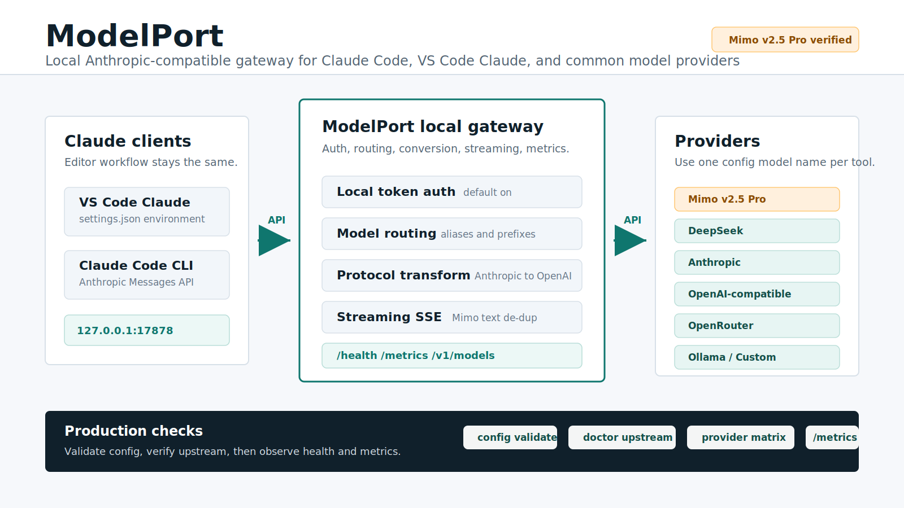

# ModelPort

[](https://github.com/tiammomo/ModelPort/actions/workflows/ci.yml)

**English** | [简体中文](README.zh-CN.md)

ModelPort is a self-hosted multi-protocol model gateway for Claude Code,
VS Code Claude, OpenAI-compatible SDKs, and API clients. Its `/v1/messages` and
`/v1/chat/completions` edges share authentication, policy, quotas, routing,
usage settlement, Provider health, and a small-team dashboard across
Anthropic-compatible and OpenAI-compatible Providers.

The product direction is a governed, multi-protocol enterprise model gateway.
The current release has not reached that target; see the
[Enterprise Gateway Roadmap](docs/ENTERPRISE_ROADMAP.md) for the architecture,
migration workstreams, and evidence-based release gates.



ModelPort is intended for one trusted host or a small trusted network. It is
not a public multi-tenant model platform, a chat client, or a model runtime.

## Implemented Surface

- Anthropic-compatible `POST /v1/messages`, opt-in exact
  `POST /v1/messages/count_tokens`, scoped OpenAI-compatible
  `POST /v1/chat/completions`, and `GET /v1/models`.
- Anthropic pass-through and OpenAI Chat Completions conversion.
- Anthropic-style SSE conversion, including common Tool Use deltas, complete
  per-tool JSON Schema response validation, and semantic Tool outcome telemetry.
- Opt-in one-attempt, non-stream repair for strict tool-argument Schema failures,
  with redacted prompts, attempt-level ledger evidence, and aggregate accounting.
- Model aliases, `provider:model`, exact-model and prefix routing.
- Legacy local token and dashboard-issued API keys with model/provider/IP,
  rolling spend-window, and user-quota policy.
- Provider credential pools, cooldown state, bounded fallback, diagnostics,
  request logs, and Prometheus metrics.
- React dashboard for users, keys, teams, quotas, providers, models, aliases,
  logs, health, audit, enterprise request/attempt evidence, redacted diagnostic
  snapshots, and an administrator-only live read of the official DeepSeek
  balance. Recharge and authoritative billing remain in the DeepSeek console.
- Versioned PostgreSQL request/attempt ledger with tenant foreign keys, SQLx
  pooling, rustls, transactional budget reservation/settlement, and immutable
  evidence events; compatibility JSON-file/PostgreSQL control state; Docker
  Compose and systemd templates.

Provider entries are configuration support, not proof of real-upstream
compatibility. Dated verification belongs in the
[provider matrix](docs/PROVIDER_MATRIX.md).

## Technical Core

- **Protocol boundary:** Anthropic Messages and the scoped OpenAI Chat
  Completions edge parse into a typed, protocol-neutral exchange model before
  the shared governance pipeline. Edge adapters preserve supported text,
  roles, function tools, Tool Use IDs, finish reasons, usage, and bounded SSE;
  unsupported fields are rejected instead of silently dropped.
- **Deterministic routing:** explicit `provider:model`, aliases, exact model
  matches, prefixes, and the default Provider resolve in a documented order.
  Cooling Providers are skipped while an eligible alternative exists, and
  fallback is limited to eligible models and retryable transport/protocol, 429,
  or 5xx failures.
- **Attempt-scoped governance:** authentication and global/identity/IP limits
  run before routing. API-key policy, user quota, API-key/team spend, Provider
  credentials, capability gates, and Provider/model limits are then checked for
  each attempt. Preflight rejection is not charged; only an attempt that was
  actually sent records quota/spend consumption. PostgreSQL mode also atomically
  reserves tenant budget before egress and settles or releases it at terminal state.
- **Retry and crash safety:** optional tenant-scoped `Idempotency-Key` claims
  prevent duplicate Provider egress, while request/attempt leases stay alive
  through complete stream delivery. Expired owners are terminalized as
  unbilled `unreconciled` evidence instead of remaining permanently in flight.
- **Defensive transport and streaming:** upstream redirects are disabled;
  request/response/SSE sizes, idle time, and concurrency are bounded; remote
  Providers require HTTPS by default; and live stream permits remain held until
  the response body completes or is dropped.
- **One control-plane truth:** environment/TOML configuration is combined with
  persisted dashboard overrides. JSON-file and PostgreSQL modes store the same
  logical auth/control documents during the migration window. A normalized
  PostgreSQL ledger records tenant-scoped requests and Provider attempts before
  upstream egress, while the dashboard remains a client of the backend rather
  than a second routing authority.
- **Evidence-aware observability:** request IDs, retained usage logs,
  Prometheus process metrics, health/cooldown state, and dashboard aggregation
  preserve whether usage came from the upstream or a local estimate. Stream
  logs and health are finalized when the response body completes, fails, or is
  dropped rather than when the initial HTTP 200 is accepted.
  Stream-only first-semantic latency is recorded at the first non-empty text or
  Tool Call event; non-stream lifecycle latency is not mislabeled as TTFT.
  A bounded `x-modelport-traffic-class` value separates business, synthetic,
  and diagnostic calls without retaining request content.

These mechanisms are implemented. PostgreSQL tenant budgets are distributed
hard admission control, but Provider invoices remain authoritative and the
compatibility user quota/spend windows are still preflight guards rather than
an exact billing system. Provider configuration is
not real-upstream verification, and a live stream can still fail after HTTP 200
without cross-Provider replay. Idempotency currently prevents a second call but
does not replay the original response. See the [technical core and its
boundaries](docs/ARCHITECTURE.md#technical-core).

## Quick Start With Docker Compose

Requirements: Docker with Compose v2 and credentials for at least one provider.

Choose the upstream topology before copying a template:

| Topology | Default provider | Required upstream secret | Notes |
| --- | --- | --- | --- |
| DeepSeek only | `deepseek` | `DEEPSEEK_ANTHROPIC_AUTH_TOKEN` | Uses the official Anthropic-compatible endpoint; supports the administrator balance read. |
| Local Qwen only | `local_qwen` | none when the runtime has no auth | Requires a TOML `local_qwen` provider and `QWEN_LOCAL_BASE_URL`; omit all DeepSeek variables. |
| Qwen + DeepSeek | either explicit choice | DeepSeek key plus reachable Qwen runtime | Recommended for QuantPilot: Qwen default, DeepSeek selected with `deepseek:<model>`. |

The upstream Provider key stays in ModelPort. Applications receive a separate
legacy router token or, preferably, a dashboard-issued scoped client API key.
See [Configuration: provider topology recipes](docs/CONFIGURATION.md#provider-topology-recipes)
for complete Qwen-only and combined TOML examples.

```bash
cp deploy/docker/modelport.env.example .env
```

For the DeepSeek-only sample, edit `.env` and replace these values. For
Qwen-only, use the topology recipe instead and omit the DeepSeek block:

```env
MODELPORT_AUTH_TOKEN=replace-with-a-long-random-local-token
ANTHROPIC_AUTH_TOKEN=replace-with-the-same-local-router-token
MODELPORT_ADMIN_USERNAME=admin
MODELPORT_ADMIN_PASSWORD=replace-with-a-long-random-admin-password
MODELPORT_POSTGRES_PASSWORD=replace-with-a-long-random-postgres-password

MODELPORT_DEFAULT_PROVIDER=deepseek
DEEPSEEK_ANTHROPIC_BASE_URL=https://api.deepseek.com/anthropic
DEEPSEEK_ANTHROPIC_AUTH_TOKEN=replace-with-a-real-provider-key
DEEPSEEK_MODEL=deepseek-v4-flash
```

`deepseek-v4-flash` is the repository's configured sample, not a claim that the
model is available to every account. Use the exact model ID enabled by your
provider.

For the maintained QuantPilot integration, configure `local_qwen` and
`deepseek` in ModelPort, issue a client key scoped to the required providers and
models, and put only that client key in QuantPilot as `MODELPORT_API_KEY`.
QuantPilot must never receive `DEEPSEEK_ANTHROPIC_AUTH_TOKEN`.

Start and inspect the stack:

```bash
docker compose up -d --build
docker compose ps
docker compose logs -f modelport
```

The default stack enables PostgreSQL and is the recommended enterprise mode.
To explicitly choose the compatibility file deployment, run
`docker compose -f docker-compose.yml -f docker-compose.files.yml up -d --build`;
auth/control state is persisted, but the enterprise request and budget ledger
is process-memory only.

Open:

- Dashboard: `http://127.0.0.1:33002`
- Liveness: `http://127.0.0.1:38082/livez`
- Messages: `http://127.0.0.1:38082/v1/messages`
- Chat Completions: `http://127.0.0.1:38082/v1/chat/completions`

Log in with `MODELPORT_ADMIN_USERNAME` and `MODELPORT_ADMIN_PASSWORD`.

## Connect Claude Code

Configure the client with the published API origin and the same router token:

```env
ANTHROPIC_BASE_URL=http://127.0.0.1:38082
ANTHROPIC_AUTH_TOKEN=replace-with-the-same-local-router-token
ANTHROPIC_MODEL=deepseek-v4-flash
ANTHROPIC_DEFAULT_OPUS_MODEL=deepseek-v4-flash
ANTHROPIC_DEFAULT_SONNET_MODEL=deepseek-v4-flash
ANTHROPIC_DEFAULT_HAIKU_MODEL=deepseek-v4-flash
ANTHROPIC_SMALL_FAST_MODEL=deepseek-v4-flash
CLAUDE_CODE_SUBAGENT_MODEL=deepseek-v4-flash
```

For the VS Code Claude extension, place these names in its environment-variable
settings and reload the extension/window. The model values must match your
configured ModelPort catalog.

## Connect OpenAI-Compatible SDKs

Point an SDK that supports a custom base URL at ModelPort and use the same
client key:

```env
OPENAI_BASE_URL=http://127.0.0.1:38082/v1
OPENAI_API_KEY=replace-with-the-same-local-router-token
OPENAI_MODEL=deepseek-v4-flash
```

Those standard `OPENAI_*` names belong to the **client process**. If ModelPort
itself uses OpenAI as an upstream Provider, configure the server separately:

```env
MODELPORT_OPENAI_BASE_URL=https://api.openai.com/v1
MODELPORT_OPENAI_API_KEY=replace-with-an-openai-platform-api-key
MODELPORT_OPENAI_MODEL=gpt-5.5
```

Do not copy the client `OPENAI_BASE_URL=http://127.0.0.1:38082/v1` into the
ModelPort service environment: that points the OpenAI Provider back at the
gateway. Legacy server-side `OPENAI_*` names still work as fallbacks and emit a
configuration warning so existing deployments can migrate safely.

The current Chat Completions edge is a documented text/function-tool
compatibility slice, not full OpenAI API parity. See the [API
reference](docs/API.md#chat-completions) before enabling an application.

## Verify

```bash
source .env

curl -fsS http://127.0.0.1:38082/livez

curl -fsS \
  -H "x-api-key: $MODELPORT_AUTH_TOKEN" \
  http://127.0.0.1:38082/v1/models

curl -fsS \
  -H "x-api-key: $MODELPORT_AUTH_TOKEN" \
  -H 'content-type: application/json' \
  http://127.0.0.1:38082/v1/messages \
  -d '{
    "model":"deepseek-v4-flash",
    "max_tokens":96,
    "messages":[{"role":"user","content":"Reply exactly: OK"}]
  }'

curl -fsS \
  -H "Authorization: Bearer $MODELPORT_AUTH_TOKEN" \
  -H 'content-type: application/json' \
  http://127.0.0.1:38082/v1/chat/completions \
  -d '{
    "model":"deepseek-v4-flash",
    "messages":[{"role":"user","content":"Reply exactly: OK"}]
  }'
```

The message request is a paid upstream call. Local checks that do not generate
text are:

```bash
scripts/config-validate.sh
scripts/status.sh
scripts/smoke-test.sh
```

Run `scripts/acceptance.sh` for control-plane acceptance and
`scripts/tool-use-acceptance.sh` for the local mock-backed Tool Use path.
Commands with `--upstream` and `provider-matrix.sh` can incur provider cost.
Every Messages request must include positive `max_tokens` no greater than
`MODELPORT_MAX_OUTPUT_TOKENS` (default 131072); invalid values are rejected
before routing.

## Important Operational Limits

- `/readyz` is authenticated diagnostics; it does not currently fail when an
  upstream is degraded; it does verify auth, control, and relational-ledger
  storage.
- A stream can fail through SSE `event: error` after the initial HTTP 200.
  Terminal status, duration, metrics, and Provider health are reconciled when
  the body completes, fails, or is dropped. Recognized Provider usage events
  replace local estimates; streams without them remain estimated, and no stream
  can fallback after downstream headers.
  Buffered compatibility mode completes the upstream first but delays the
  first byte.
- Rate limits, concurrent-stream permits, and dashboard sessions are
  process-local. Stream permits stay held through response body completion;
  quota checks are not a transactional reservation, so concurrent requests can
  overshoot a tight cap.
- Provider URL validation blocks dangerous literal addresses, but DNS answers
  are not pinned/revalidated against private ranges.
- Auth/control persistence synchronously writes complete logical JSON documents;
  retention and throughput should stay within the intended small-team profile.
- Cost and token values are operational estimates, not provider invoices. Logs
  label Provider-returned usage as `upstream-returned` and heuristic values as
  `local-estimate`; only an actually sent upstream attempt consumes user quota
  or API-key/team spend.

See [Architecture](docs/ARCHITECTURE.md) and
[Operations](docs/OPERATIONS.md) before a shared deployment.

## Security

Keep the default loopback publishing unless a trusted LAN or same-origin HTTPS
reverse proxy needs access. Do not expose the backend directly to the public
internet. Do not commit `.env`, provider keys, complete backups, prompts, or raw
sensitive logs.

Remote Providers must use HTTPS by default. Plain HTTP exposes Provider API
keys and prompt/response content; the insecure override is only for an
explicitly trusted internal upstream. Local/custom runtimes may continue to use
HTTP on loopback or a controlled local network.

The optional [OIDC console sign-in preview](docs/OIDC.md) authenticates a human
to the ModelPort dashboard and issues a ModelPort console session only. It does
not collect, forward, or proxy ChatGPT passwords, cookies, browser sessions, or
subscriptions, and those are not OpenAI API credentials. Data-plane callers
still use ModelPort API keys; upstream OpenAI or other Provider credentials stay
server-side.

For shared use:

1. Create dashboard API keys for real active users and set
   `MODELPORT_REQUIRE_CONTROL_API_KEYS=1`.
2. Configure exact trusted proxy CIDRs and allowed browser origins.
3. Set `MODELPORT_ADMIN_COOKIE_SECURE=1` behind HTTPS.
4. Protect PostgreSQL/JSON state and CLI backup files as credential material.

Read [SECURITY.md](SECURITY.md) for the threat model and reporting process.

## Local Development

```bash
cp .env.example .env
# replace required placeholders
scripts/config-validate.sh
scripts/start.sh

cd dashboard
npm ci
npm run dev
```

Before submitting changes:

```bash
scripts/check-all.sh
```

The complete toolchain and test matrix are in
[Development](docs/DEVELOPMENT.md).

## Documentation

- [Documentation index](docs/README.md)
- [Architecture](docs/ARCHITECTURE.md)
- [Configuration reference](docs/CONFIGURATION.md)
- [API reference](docs/API.md)
- [Operations](docs/OPERATIONS.md)
- [Docker Compose](docs/DOCKER.md)
- [systemd](docs/SYSTEMD.md)
- [Provider compatibility](docs/PROVIDER_MATRIX.md)
- [Tool Use compatibility](docs/TOOL_USE_COMPATIBILITY.md)
- [Production acceptance](docs/ACCEPTANCE.md)

## License

[MIT](LICENSE)
