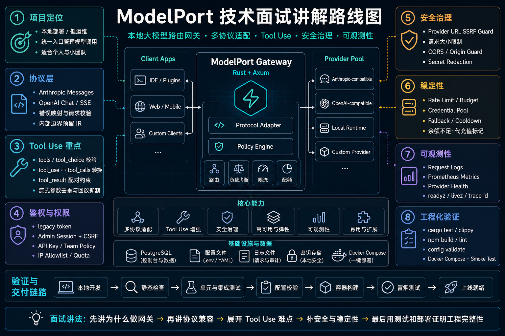
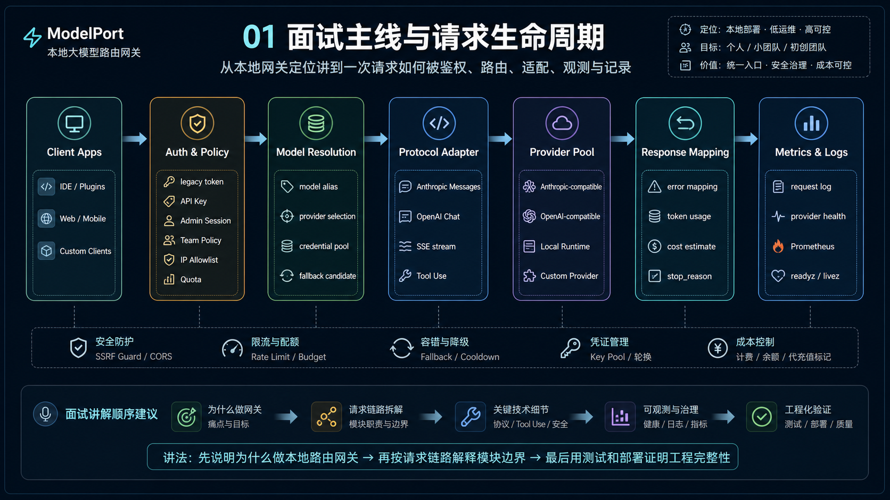
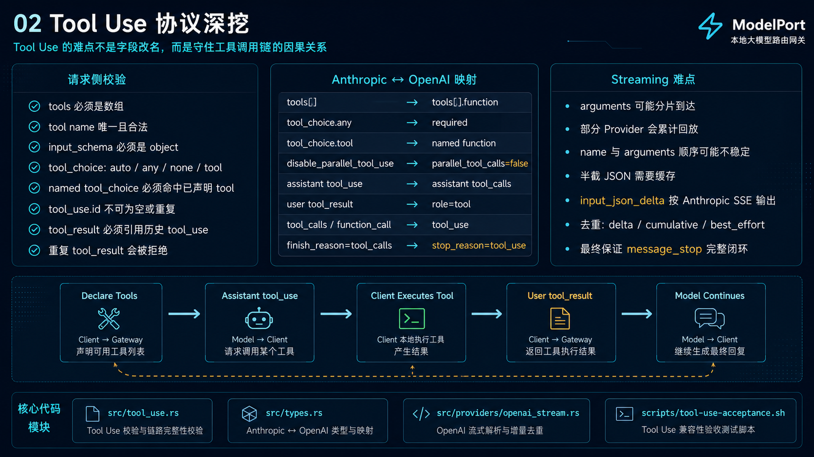
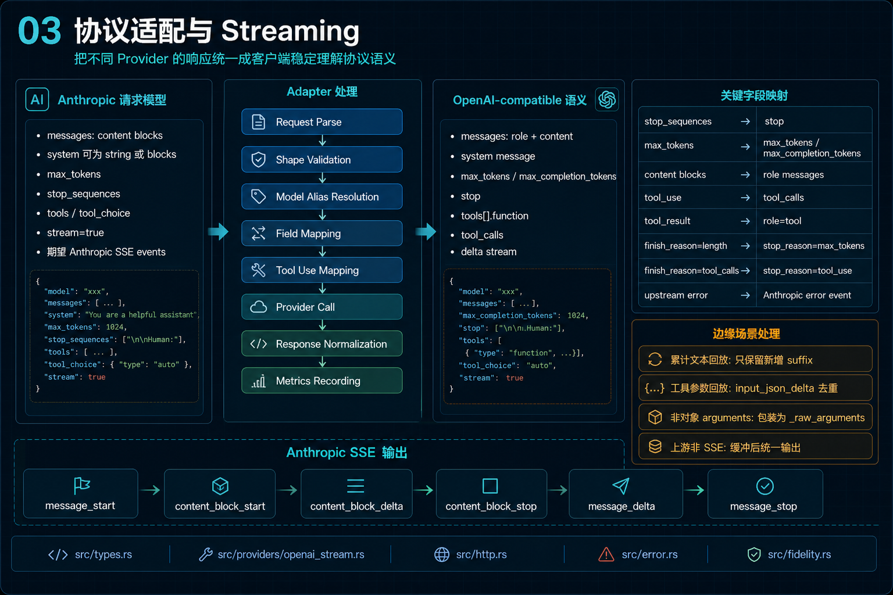
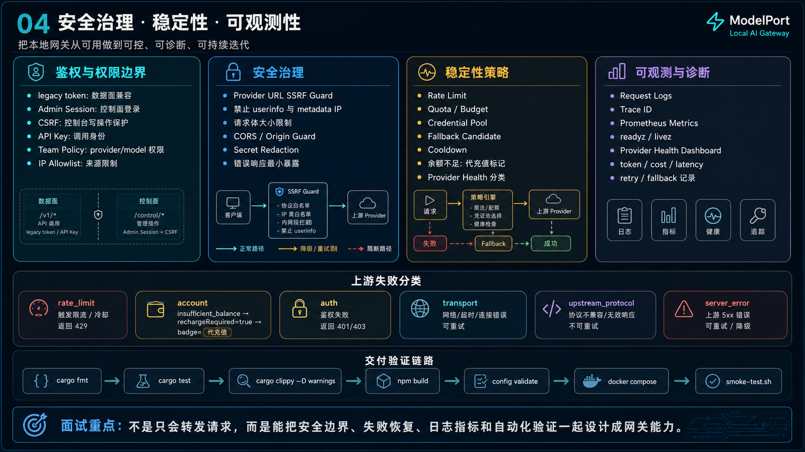

# ModelPort 技术面经

这份材料用于把 ModelPort 讲成一个完整工程项目，而不是一个 API 转发 demo。面试时建议按“定位 -> 架构 -> 请求链路 -> Tool Use -> 协议层 -> 安全稳定观测 -> 验证闭环”的顺序讲。

## 0. 开场版本

30 秒版本：

> ModelPort 是一个面向个人开发者、小团队和初创团队的本地大模型路由网关。它统一接收客户端请求，管理鉴权、模型路由、Provider 适配、Tool Use、限流预算、请求日志和 Provider 健康状态。它的重点不是做重企业平台，而是用低运维成本把多协议、多 Provider 的模型调用治理起来。

3 分钟版本：

> ModelPort 的核心链路是 Client Apps -> ModelPort Gateway -> Provider Pool。客户端可以是 IDE 插件、Web、移动端或自定义客户端；网关侧用 Rust + Axum 承接请求，在入口做鉴权、策略、配额和模型解析，然后根据 provider 协议选择 Anthropic-compatible 直通或 OpenAI-compatible 转换。返回时再统一做错误映射、token/费用统计、request log、metrics 和 Provider health 更新。项目里比较有技术含量的是 Tool Use 协议适配、SSE streaming 归一化、安全边界、凭证池和 fallback。

面试完整展开时，可以按下面 5 张图讲。

## 1. 项目总览图



这张图适合开场。先讲 ModelPort 不是聊天客户端，也不是云端模型平台，而是本地模型路由网关。

推荐讲法：

> 我会从 8 个方面介绍这个项目：项目定位、协议层、Tool Use、鉴权与权限、安全治理、稳定性、可观测性、工程化验证。中间这条主链路是核心：客户端进入 ModelPort Gateway，再通过协议适配和策略层路由到不同 Provider。项目定位是个人和小团队，所以我没有一开始引入 Redis、Kubernetes、OIDC 或复杂多租户，而是优先做低运维、高收益的治理能力。

重点强调：

- ModelPort 管的是模型调用入口，不是模型本身。
- 它要处理多客户端、多协议、多 Provider、多凭证和多种失败模式。
- 管理台是轻量控制面，服务数据面仍然保持简单。
- 工程完整性通过测试、配置校验、Docker Compose 和 smoke test 证明。

可追问回答：

**Q: 这和普通 API Proxy 有什么区别？**

普通 Proxy 主要转发请求。ModelPort 还做协议语义转换、Tool Use 校验、Provider 能力门禁、鉴权权限、限流预算、上游健康分类、日志指标和控制面管理，所以更接近本地大模型路由网关。

**Q: 为什么不一开始做企业级平台？**

项目定位是个人、小团队和初创团队。早期最需要的是稳定、低运维、能排障。重企业能力会增加复杂度，只有在多实例部署、外部组织接入和强合规需求出现后才值得引入。

## 2. 请求生命周期



这张图用来讲一次请求如何经过网关。

推荐讲法：

> 一次请求进入网关后，先经过 Auth & Policy。这里会区分 legacy token、API Key、Admin Session，并结合 Team Policy、IP Allowlist 和 Quota 做权限判断。然后进入 Model Resolution，把用户传入的 model 解析成具体 provider、真实模型、可用凭证和 fallback 候选。接着 Protocol Adapter 决定是走 Anthropic-compatible 直通，还是转换成 OpenAI Chat/SSE。Provider 返回后再做 Response Mapping，把错误、token、费用、stop_reason 和日志指标统一起来。

可以按模块展开：

- `Client Apps`：IDE、插件、Web、移动端、自定义客户端。
- `Auth & Policy`：数据面 token 和控制面 session 分离。
- `Model Resolution`：模型别名、provider 选择、凭证池、fallback。
- `Protocol Adapter`：Anthropic Messages、OpenAI Chat、SSE、Tool Use。
- `Provider Pool`：Anthropic-compatible、OpenAI-compatible、本地运行时、自定义 Provider。
- `Metrics & Logs`：请求日志、Provider health、Prometheus、`readyz / livez`。

可追问回答：

**Q: 路由是怎么做边界设计的？**

请求入口不直接知道 provider 的所有细节，而是先解析成 provider/model/credential，再交给协议适配层。这样模型选择、权限策略和协议转换是分开的，后续加 Provider 时不会把入口路由写成一大坨条件分支。

**Q: 为什么要做 readyz 和 livez？**

`livez` 判断进程活着，适合基础存活探测；`readyz` 更适合判断服务是否准备好处理真实请求，并返回 Provider health、存储状态等更具体的信息。

相关代码：

- [src/routes/client_api.rs](../../src/routes/client_api.rs)
- [src/routes/ops.rs](../../src/routes/ops.rs)
- [src/config.rs](../../src/config.rs)
- [src/control.rs](../../src/control.rs)

## 3. Tool Use 深挖



这张图是最适合重点讲的部分。建议至少讲 5 分钟。

先讲问题：

> Tool Use 的难点不是字段改名，而是要守住工具调用链路的因果关系。一次工具调用从声明 tools 开始，模型产生 assistant tool_use，客户端执行工具，再用 user tool_result 回传结果，模型继续生成。任何一个 id、role、arguments 或流式事件错了，客户端执行链都会断。

请求侧校验可以这样讲：

- `tools` 必须是数组。
- tool name 必须唯一，且长度、字符集合法。
- `input_schema` 必须是 object schema。
- `tool_choice` 只允许 `auto / any / none / tool`。
- named `tool_choice` 必须命中已声明 tool。
- assistant `tool_use` 必须有非空 `id/name/input`。
- user `tool_result` 必须引用历史 `tool_use.id`。
- 重复 `tool_use.id` 或重复回答同一个 `tool_use_id` 会被拒绝。

协议映射可以这样讲：

- Anthropic `tools[]` -> OpenAI `tools[].function`。
- Anthropic `tool_choice.any` -> OpenAI `required`。
- Anthropic `tool_choice.tool` -> OpenAI named function。
- `disable_parallel_tool_use=true` -> `parallel_tool_calls=false`。
- assistant `tool_use` -> assistant `tool_calls`。
- user `tool_result` -> OpenAI `role=tool`。
- OpenAI `tool_calls / function_call` -> Anthropic `tool_use`。
- OpenAI `finish_reason=tool_calls` -> Anthropic `stop_reason=tool_use`。

Streaming 难点可以这样讲：

> 流式工具参数最麻烦。不同 Provider 可能发纯 delta，也可能不断回放累计 arguments；有些 Provider 先发 arguments 后发 name；有些 arguments 直到最后才组成完整 JSON。ModelPort 在 OpenAI-compatible stream 到 Anthropic SSE 的转换里，会处理 delta/cumulative/best_effort 几种模式，避免客户端看到重复参数或破碎事件。

亮点回答：

**Q: 你们 Tool Use 做到什么粒度？**

我们做到了请求校验、Provider 能力门禁、Anthropic/OpenAI 双向映射、legacy `function_call` 兼容、流式 `input_json_delta` 输出、累计回放去重、工具结果引用校验和 acceptance 脚本验证。它不是简单把 `tool_use` 改成 `tool_calls`。

**Q: 为什么要拒绝错误 tool_result，而不是直接转发？**

因为 tool_result 引用关系错误会破坏客户端的工具执行上下文。提前在网关拒绝，比让上游产生不可预测响应更可控，也更容易定位问题。

**Q: 为什么现在没有引入完整内部 Tool IR？**

当前 Provider 数量和协议差异还在可控范围内，结构化 adapter 更简单、更容易测试。IR 会增加抽象成本。等后续出现多个 Provider 都需要 schema transformation、argument repair 或深度 replay diagnostics 时，再引入 IR 更合理。

相关代码和文档：

- [src/tool_use.rs](../../src/tool_use.rs)
- [src/types.rs](../../src/types.rs)
- [src/providers/openai_stream.rs](../../src/providers/openai_stream.rs)
- [docs/TOOL_USE_COMPATIBILITY.md](../TOOL_USE_COMPATIBILITY.md)
- [scripts/tool-use-acceptance.sh](../../scripts/tool-use-acceptance.sh)

## 4. 协议适配与 Streaming



这张图用来讲 Anthropic-compatible 和 OpenAI-compatible 的语义差异。

推荐讲法：

> ModelPort 入口以 Anthropic Messages 为主，因为客户端期望的是 Anthropic-compatible 行为。但很多上游是 OpenAI-compatible，所以网关要把 content blocks 转成 role messages，把 `tools/tool_choice/tool_use/tool_result` 转成 OpenAI 的 `tools/tool_calls/role=tool`，再把上游响应映射回 Anthropic message 和 SSE events。

关键转换：

- `stop_sequences` -> `stop`。
- `max_tokens` -> `max_tokens / max_completion_tokens`，取决于 Provider 配置。
- content blocks -> role messages。
- `tool_use` -> `tool_calls`。
- `tool_result` -> `role=tool`。
- `finish_reason=length` -> `stop_reason=max_tokens`。
- `finish_reason=tool_calls` -> `stop_reason=tool_use`。
- upstream error -> Anthropic error event。

Streaming 输出可以这样讲：

> 对客户端来说，最重要的是看到稳定的 Anthropic SSE 事件序列：`message_start -> content_block_start -> content_block_delta -> content_block_stop -> message_delta -> message_stop`。上游怎么发不重要，ModelPort 要把差异消化掉。

边界场景：

- 累计文本回放：只保留新增 suffix。
- 工具参数回放：`input_json_delta` 去重。
- 非对象 arguments：包装为 `_raw_arguments`。
- 上游非 SSE：缓冲后统一输出。
- OpenAI legacy `function_call`：转换为 Anthropic `tool_use`。

可追问回答：

**Q: 为什么非对象 arguments 要包装成 `_raw_arguments`？**

Anthropic `tool_use.input` 期望是对象。如果 OpenAI-compatible 上游返回字符串、数组或非法 JSON，直接透传会破坏客户端契约。包装成 `_raw_arguments` 可以保留信息，同时让 Anthropic 侧结构合法。

**Q: 为什么要做 fidelity 检查？**

不是所有 Anthropic 字段都能被 OpenAI-compatible Provider 无损表达。fidelity 检查可以提前发现无法保真的字段，避免静默丢语义。

相关代码：

- [src/types.rs](../../src/types.rs)
- [src/providers/openai_stream.rs](../../src/providers/openai_stream.rs)
- [src/fidelity.rs](../../src/fidelity.rs)
- [src/http.rs](../../src/http.rs)
- [src/error.rs](../../src/error.rs)

## 5. 安全治理、稳定性、可观测性



这张图用来证明项目不是 demo，而是有网关级治理能力。

鉴权和权限边界：

- legacy token 用于数据面兼容。
- Admin Session 用于控制台登录。
- CSRF 保护控制台写操作。
- API Key 表示调用身份。
- Team Policy 控制 provider/model 权限。
- IP Allowlist 限制来源。

安全治理：

- Provider URL SSRF Guard。
- 禁止 userinfo 与 metadata IP。
- 请求体大小限制。
- CORS / Origin Guard。
- Secret Redaction。
- 错误响应最小暴露。

稳定性策略：

- Rate Limit。
- Quota / Budget。
- Credential Pool。
- Fallback Candidate。
- Cooldown。
- 余额不足展示“代充值”标记。
- Provider Health 分类。

可观测和诊断：

- Request Logs。
- Trace ID。
- Prometheus Metrics。
- `readyz / livez`。
- Provider Health Dashboard。
- token / cost / latency。
- retry / fallback 记录。

失败分类可以这样讲：

> 我们不会把所有上游错误都当成 500。网关会区分 `rate_limit`、`account`、`auth`、`transport`、`upstream_protocol`、`server_error`。比如余额不足会被归类成 account issue，设置 `rechargeRequired=true`，控制台展示 `代充值`，同时给出建议操作。

可追问回答：

**Q: SSRF 防护为什么重要？**

Provider Base URL 是可配置项，如果不限制，攻击者可能把上游地址配置成 metadata IP、内网地址或带 userinfo 的 URL，从而探测本机或内网资源。网关作为本地服务尤其要守住 provider URL 边界。

**Q: 控制面和数据面为什么要分开鉴权？**

调用模型和管理系统是两种权限。数据面 token 可以发请求，但不能创建用户、改 Provider、看所有日志。控制面使用 Admin Session + CSRF，避免普通调用凭证扩大成管理权限。

**Q: Provider health 有什么实际价值？**

它让 fallback、cooldown、凭证轮转和控制台诊断有依据。用户可以看到是限流、余额不足、认证失败还是网络错误，而不是只看到“请求失败”。

相关代码：

- [src/auth.rs](../../src/auth.rs)
- [src/policy.rs](../../src/policy.rs)
- [src/provider_status.rs](../../src/provider_status.rs)
- [src/provider_credentials.rs](../../src/provider_credentials.rs)
- [src/metrics.rs](../../src/metrics.rs)
- [src/routes/logs_view.rs](../../src/routes/logs_view.rs)
- [src/http.rs](../../src/http.rs)

## 6. 工程化验证怎么收尾

最后用验证链路收住：

```bash
cargo fmt -- --check
cargo test
cargo clippy --all-targets --all-features -- -D warnings
npm run build
scripts/config-validate.sh
docker compose up -d --build
scripts/smoke-test.sh
scripts/tool-use-acceptance.sh
```

推荐话术：

> 我会把项目收尾到工程验证上。因为网关处在客户端和上游 Provider 中间，如果协议转换、权限判断、限流、fallback、日志任何一环出错，排障成本都很高。所以我把验证拆成 Rust 单测、前端构建、配置校验、Docker Compose 启动、smoke test 和 Tool Use acceptance。尤其是 Tool Use acceptance，会用 mock OpenAI-compatible upstream 验证非流式、流式、tool_result continuation、非法请求拒绝和 parallel tool calls 映射。

## 7. 高频追问速答

**Q: 项目最大技术难点是什么？**

Tool Use 和 streaming 协议归一化。普通文本转发很容易，但工具调用涉及 id、role、arguments、finish reason、SSE event 顺序和多轮因果关系，必须结构化处理。

**Q: 为什么选择 Rust + Axum？**

网关是长时间运行的 I/O 服务，需要稳定的并发、明确的错误处理和较低运行成本。Rust 的类型系统适合把协议结构、错误分类和配置校验做得更可靠，Axum 则足够轻量。

**Q: 如何避免过度设计？**

项目明确面向个人和小团队，所以优先使用 Docker Compose、本地配置、PostgreSQL 和内置控制面。Redis、Kubernetes、OIDC、复杂多租户都不是当前默认选项，只有当多实例、组织级权限或外部运维需求出现时再引入。

**Q: 如果要继续演进，下一步做什么？**

第一优先级是继续增强 Tool Use compatibility 和 provider acceptance matrix。第二是更细的 Provider health 趋势、账号池权重和长期成功率。第三是在 Provider 数量增多后评估是否引入内部 IR，降低协议适配复杂度。

**Q: 如何证明它不是只能跑某一个模型？**

架构上 Provider 是协议和配置驱动的，有 Anthropic-compatible、OpenAI-compatible、本地运行时和自定义 Provider 四类入口。DeepSeek 可以作为标准样例，但不是能力边界。

## 8. 不要这样讲

不要说：

- “这就是一个转发服务。”
- “支持所有模型完全无损。”
- “已经是企业级平台。”
- “Tool Use 就是字段替换。”
- “后续一定要上 Kubernetes。”

更好的说法：

- “这是一个轻量但治理完整的本地模型路由网关。”
- “对已适配协议做结构化兼容，对不能保真的字段做校验和边界说明。”
- “当前目标是个人和小团队，企业能力按触发条件演进。”
- “Tool Use 重点是多轮调用因果关系、流式参数和协议语义一致性。”

## 9. 一句话收尾

> ModelPort 的价值不是把请求转出去，而是把本地大模型调用变成一个可治理、可诊断、可验证、可逐步扩展的工程系统。
